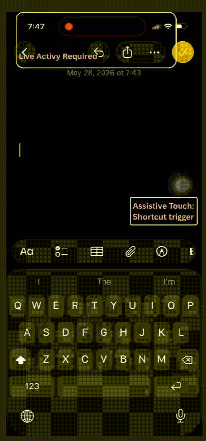

#  Swift/iOS: A Better/Alternative Way to Make A Dictation App

**This Repository is under [AGPL License](./LICENSE.md)**

This repository shows an alternative way of making a dictation app

1. No Keyboard extension
2. Open Main App Only On First Record 
3. No Mic Running ALL TIME 
4. Auto Back to previous app / Home Behavior without Private APIs nor trying to match bundle Id with custom URL schemes

To test the app out, 

1. Run the app
2. Add the shortcuts (for starting and stoping dictation) to shortcuts app using the share link
3. Link the shortcuts with some assistive touches.
4. trigger the shortcuts to start and stop dictation.
5. Paste the dictated content (manually...)

For more details on the implementation, please check out My blog: [Swift/iOS: A Better(?) Way to Make A Dictation App](https://medium.com/@itsuki.enjoy/swift-ios-a-better-way-to-make-a-dictation-app-7badd94103e0)

